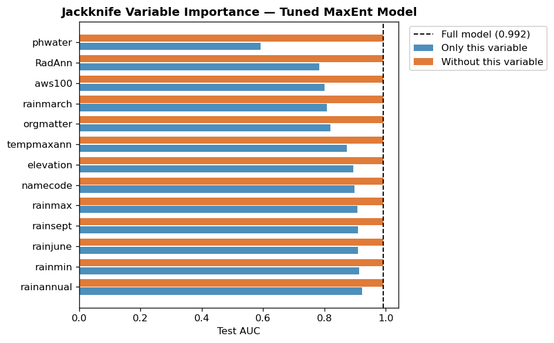

# Species Distribution Modeling with MaxEnt: Predicting Suitable Coffee Cultivation Areas on Hawaii Island

A single-notebook, classroom-facing workflow for teaching MaxEnt (maximum entropy) species distribution modeling on the [I-GUIDE Platform](https://i-guide.io/).

MaxEnt is often treated as a black box: environmental layers and presence points go in, a suitability map comes out, and the choices in between stay hidden. This notebook unpacks that box through a concrete case — assessing where coffee can be grown on the island of Hawaii — and is organized around a **baseline vs. tuned** comparison so that the effect of feature classes, regularization, background sample size, and variable selection is visible at every step.



## Contents

| Path | Description |
| --- | --- |
| [Species_Distribution_Modeling_with_MaxEnt.ipynb](Species_Distribution_Modeling_with_MaxEnt.ipynb) | The complete workflow — data prep, baseline model, grid search, tuned model, comparison |
| [Data_HawaiiCropProject/](Data_HawaiiCropProject/) | Crop presence points (`Allwithmonthrain.csv`) and environmental rasters (`EnvLayers/`) |
| [MaxEnt_Baseline/](MaxEnt_Baseline/) | Baseline suitability raster written by the notebook |
| [MaxEnt_Tuned/](MaxEnt_Tuned/) | Tuned suitability rasters (cloglog and raw output transforms) |
| [jackknife_importance.png](jackknife_importance.png) | Pre-saved jackknife chart, shown when the jackknife cell is skipped |

## Notebook roadmap

1. **Introduction** — what MaxEnt is, why it suits this problem, and why coffee was chosen.
2. **Data and Operational Inputs** — coffee presence points and the 18-layer environmental raster stack, with loading and verification steps.
3. **Scenario 1 — Baseline MaxEnt Model** — minimal configuration (linear + quadratic features, β = 1.0, 10,000 background points, all 18 variables) as a reference point.
4. **Scenario 2 — Tuned MaxEnt Model** — a 90-combination grid search over feature classes, β, background size, and variable subsets, then a tuned fit with side-by-side maps, ROC curves, permutation importance, jackknife importance, and response curves.
5. **Key Takeaways, Limitations, and References.**

## Data

Both inputs come from the Hawaii County Food Self-Sufficiency Baseline dataset (Melrose & Delparte, 2012) and the environmental layers compiled by Kemp (2012). All layers share one grid and are projected to **UTM NAD 1983 Zone 5N (EPSG:26905)**.

- **Presence points** — `Allwithmonthrain.csv` holds point locations for 11 crop categories on Hawaii Island; the notebook filters to the 6,014 **Coffee** records, concentrated along the western Kona slopes.
- **Environmental predictors** — 18 raster layers:
  - *Terrain*: elevation, slope
  - *Climate*: annual max/min temperature, annual rainfall, min/max monthly rainfall, March / June / September rainfall, annual solar radiation
  - *Soil (continuous)*: available water storage, bulk density, pH, organic matter
  - *Soil (categorical)*: drainage class, texture code, map unit code

The setup cell downloads the dataset from I-GUIDE platform storage and **falls back to the local `Data_HawaiiCropProject/` folder** if the download fails, so the notebook runs offline from this repository as-is. ESRI ASCII grids are converted once to GeoTIFF with an embedded CRS (into `Data_HawaiiCropProject/EnvLayers_tif/`) to keep `elapid.annotate` working on older `geopandas` versions.

## Getting started

```bash
git clone https://github.com/Jadey-Gao/Species-Distribution-Modeling-with-MaxEnt-I-GUIDE-.git
cd Species-Distribution-Modeling-with-MaxEnt-I-GUIDE-
jupyter lab Species_Distribution_Modeling_with_MaxEnt.ipynb
```

Then run the cells top to bottom. On the I-GUIDE Platform, open the notebook and run it directly — no extra setup needed.

### Requirements

Python 3.9+ with `elapid`, `geopandas`, `rasterio`, `numpy`, `pandas`, `matplotlib`, `scikit-learn`, and `tqdm`. The first cell checks each import and pip-installs anything missing, so a clean environment works too:

```bash
pip install elapid geopandas rasterio numpy pandas matplotlib scikit-learn tqdm
```

### Runtime notes

- The **grid search** cell (Section 4.1) is stored as a string literal and not executed by default. Its best parameters — top-13 variables, `linear + quadratic + hinge + product`, β = 1.5, 10,000 background points — are hard-coded in the following cell. Un-comment and run it to reproduce the search or to re-tune on different data.
- The **jackknife** cell (Section 4.3c) fits 2 × 13 additional models and takes 5–10 minutes. Set `RUN_JACKKNIFE = False` to skip it and display the pre-saved chart instead.

## Expected outputs

- Verification of the coffee presence points and the environmental raster stack (grid consistency table, 18-panel layer preview)
- A baseline suitability prediction with AUC/ROC and permutation-importance diagnostics
- A tuned suitability prediction with response curves and jackknife-style variable importance
- Side-by-side baseline vs. tuned suitability maps, plus a cloglog vs. raw output-transform comparison

## Key takeaways

- **Parameter choices have measurable effects.** The grid search found a configuration that improved test AUC over the baseline and narrowed the train–test gap, with richer feature classes and stronger regularization (β = 1.5) working together to curb overfitting.
- **Elevation and seasonal rainfall dominate.** Permutation importance ranks them at the top in both scenarios, consistent with Kona coffee's agroclimatic profile; the tuned map shows a tighter high-suitability core along the Kona belt.
- **AUC alone is not enough.** High discrimination does not guarantee ecologically meaningful predictions — response curves and domain knowledge should be part of every MaxEnt workflow.

## Limitations

- Presence points reflect **cultivation history, not environmental potential**; suitable but un-planted terrain is under-represented.
- Climate layers are **historical averages** (temperature 1971–2000, rainfall 1978–2007), so the surface describes past conditions, not current or future projections.
- cloglog output is **relative suitability**, not calibrated probability; cross-model or cross-species comparison needs further normalization.

## References

**Data**

- Melrose, J., & Delparte, D. (2012). *Hawaii County Food Self-Sufficiency Baseline 2012.* Department of Geography and Environmental Studies, University of Hawaii at Hilo.
- Kemp, K. K. (2012). *The Hawai'i Island Crop Probability Map: An Update of the Crop Growth Parameters for the Hawaii County Crop Model.* Los Angeles: USC GIS Research Lab (now the Spatial Sciences Institute).

**Software**

- Anderson, C. B. (2023). elapid: Species distribution modeling tools for Python. *Journal of Open Source Software*, 8(84), 4930. https://doi.org/10.21105/joss.04930

## Contributor

- **Yibin Gao** — [@Jadey-Gao](https://github.com/Jadey-Gao)
